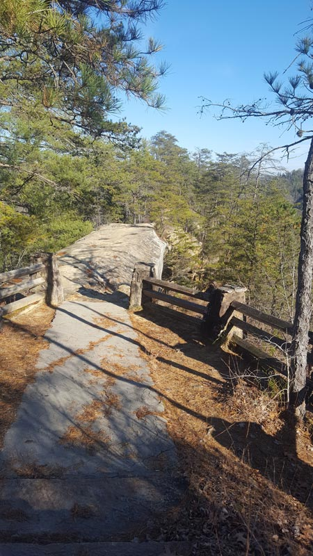
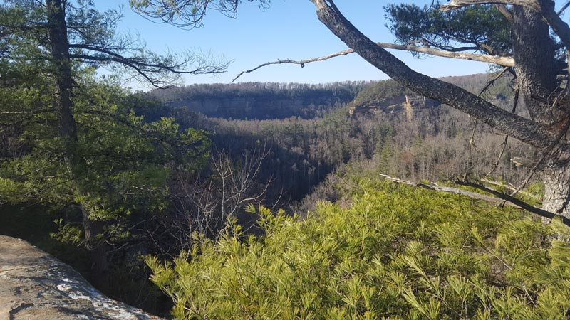
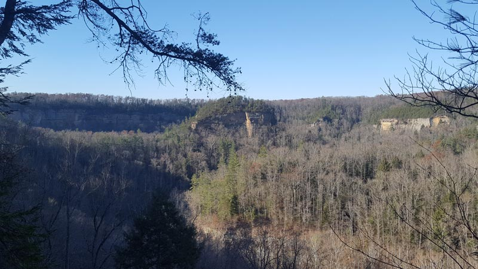
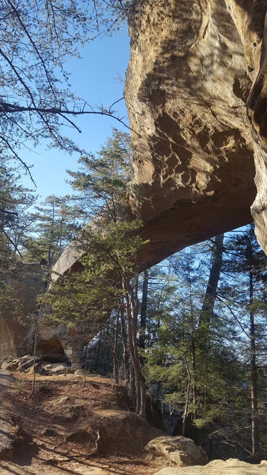
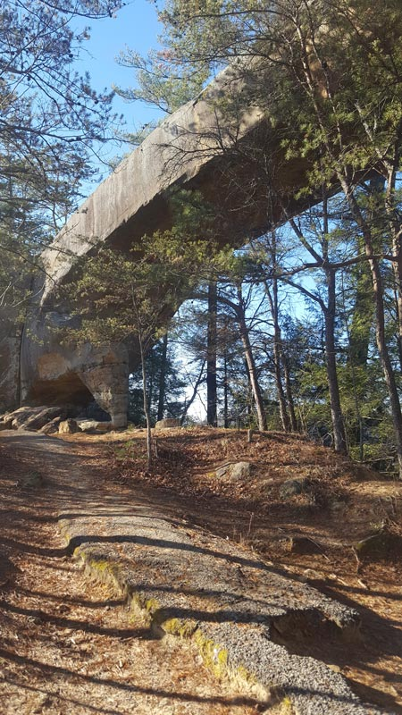

# Red River Gorge

## A project that explores Sky Bridge arch

## Summary information

Sky Bridge is about 25 feet tall and 75 feet wide

## Animation

* [Video of 3D Animation](https://youtu.be/iIf4jES8OP0)

## Maps

* [Base map of Red River Gorge arches](basemaps/rrg.pdf)

* [Cliffs over 40 feet high around Sky Bridge](#) <!-- This needs to be created from lab 7. -->

## Web pages

* [Welcome to the Red River Gorge](https://clcpm.github.io/rrg/)

* [Explore Sky Bridge](skybridge) <!-- This needs to be customized for sky bridge -->

## Photographs of Sky Bridge

## Large photographs of  Sky Bridge

[Approaching Sky Bridge](images/20181210_141435.jpg)

[View of Sky Bridge](images/20181210_144015.jpg)

[View of Sky Bridge 2](images/20181210_144035.jpg)

[Underneath Sky Bridge](images/20181210_144058.jpg)

[View from on top of Sky Bridge](images/20181210_144204%20(1).jpg)

[View from on top of Sky Bridge 2](images/20181210_141729.jpg)

## Mapbox Map of Arch

https://www.mapbox.com/studio/styles/cempie11/cjpd2sztac0dn2snzo8055304/edit/

## Description of Feature

Sky Bridge is located in the eastern part of the Red River Gorge. The trail for Sky Bridge is about a 1 mile long loop. The trail starts by walking down a short path to where you are standing on top of the arch. The views from the top of the arch are incredible. The trail then continues along for a while until it turns around and descends to where you can view the arch from the ground and you can also walk underneath the arch. The trail then continues to a set of stairs that you climb back up to the parking lot.
